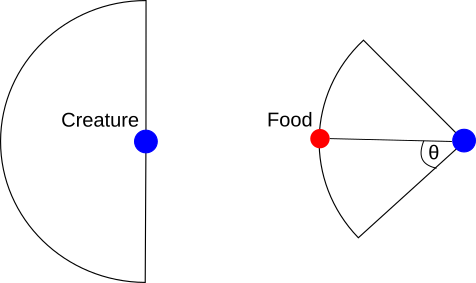

# Candied - ewolucyjny model agentowy
W naszym projekcie dotyczącym algorytmów genetycznych postanowiliśmy zbadać 

## Założenia modelu
Każdy agent reprezentuje zwierzę ustawione w losowym miejscu an płaszczyźnie o periodycznych warunkach brzegowych.
Aby przeżyć i się rozmnożyć każdy agent musi zjeść dwa cukierki, losowo rozrzucone po planszy. Jeśli uda mu się zjeść
jednego cukierka wciąż przeżyje, lecz będzie miał mniej siły na poszukiwania następnego dnia. Jeśli nie uda mu się zjeść
nic, wówczas umrze z głodu.

Agenci nie oddziałują bezpośrednio, ale konkurują o ograniczone zasoby pożywienia. Każdy agent rozpoczyna dzień z pewną
energią początkową *E*, którą zużywa aby znaleźć i skonsumować cukierki. Jeśli przez *n* poprzednich dni zjadł tylko
jednego cukierka, to jego początkowa energia spada do 25% * *n * E*.

Agenci poruszają się po planszy zgodnie ze swoim **genotypem**. Jeśli w ich zasięgu wzroku nie znajduje się żaden
cukierek, wówczas wykonują krok w losowym kierunku ze stożka (-π/2, +π/2). Jeśli widzą pożywienie stożek ten zawęża się do
(-θ, +θ), gdzie θ jest kątem skupienia agenta.

Mamy nadzieję znaleźć zestaw genów, który zminimalizuje zużytą w ciągu dnia energię.

## Ewolucja
Każdy osobnik posiada trzy zasadnicze geny, definiujące jego zachowanie:

- **prędkość *v*** wyznacza odległość, którą agent przebywa w jednym kroku czasowym. Koszt prędkości jest proporcjonalny
		do **kwadratu** prędkości (podobnie do energii kinetycznej);
- **zasięg wzroku *r*** pozwala agentowi widzieć znajdujące się bliżej niż *r* cukierki i poruszać się w ich kierunku.
		Koszt zasięgu wzroku jest **proporcjonalny** do *r*;
- **kąt skupienia θ** to połówkowy kąt rozwarcia stożka możliwych kierunków ruchu gdy w zasięgu wzroku znajduje się
		cukierek. Koszt kąta skupienia jest proporcjonalny do *cot(θ/2)*.

Pod koniec dnia wszystkie *N* osobników którzy zjedli 2 cukierki (potencjalnych rodziców) może się rozmnożyć. Spośród
nich losujemy *N* rodziców bez zwracania, a następnie dobieramy ich w pary. Jeśli osobnik został wylosowany więcej niż
raz może być w parze z samym sobą.

Każda para rodziców produkuje dwójkę potomstwa, korzystając z **operatora dodawania**. Geny ich dzieci obliczane są
według wzoru:

gdzie μ jest losową liczbą pomiędzy 0 a 1, *p* oznacza gen jednego z rodziców a *x* gen dziecka. Liczba μ jest taka sama
dla każdego dziedziczonego genu.

Dodatkowo przeprowadzana jest mutacja potomstwa. Liczba losowa ze standardowego rozkładu normalnego jest mnożona przez
podatność σ i dodana od genu. Podatność dziedziczona jest tak samo jak pozostałe geny, lecz sama nie mutuje.

Potomstwo zostaje losowo rozmieszczone na planszy, podczas gdy wszyscy agenci którym udało się przeżyć dzień zaczynają w
miejscu, w którym skończyli.
